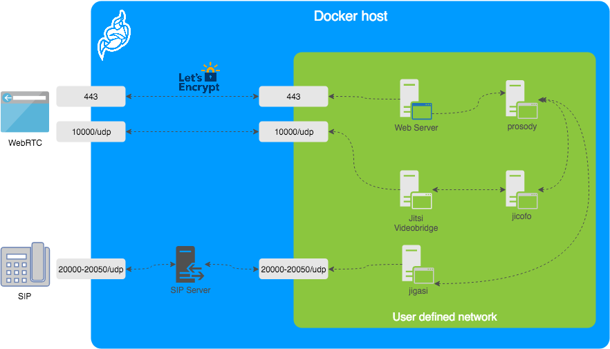

# docker-jitsi-meet


- pull
````shell
git clone https://github.com/jitsi/docker-jitsi-meet.git
````

- env
````shell
# env.example -> .env

# System time zone.
TZ=Asia/Shanghai

# IP address of the Docker host. See the "Running on a LAN environment" section
# in the README.
DOCKER_HOST_ADDRESS=118.24.86.242

# Exposed HTTP port.
HTTP_PORT=80

# Exposed HTTPS port.
HTTPS_PORT=443

````

- fireware



````shell

sudo firewall-cmd --add-port=10000/udp --permanent 
sudo firewall-cmd --add-port=4443/tcp --permanent


sudo firewall-cmd --add-port=80/tcp --permanent
sudo firewall-cmd --add-port=443/tcp --permanent


sudo firewall-cmd --add-port=5222/tcp --permanent
sudo firewall-cmd --add-port=5269/tcp --permanent
sudo firewall-cmd --add-port=5280/tcp --permanent
sudo firewall-cmd --add-port=5347/tcp --permanent

firewall-cmd --reload 
````

- run
````shell

# down
docker-compose down

# up
docker-compose up -d

# restart
docker-compose down ; docker-compose up -d
````


- custom
- - mount
    ````shell
    # docker-compose.yml services.web.volumes
    # ${CONFIG}/jitsi-meet-web:/usr/share/jitsi-meet
    
    services:
        # Frontend
        web:
            image: jitsi/web
            ports:
                - '${HTTP_PORT}:80'
                - '${HTTPS_PORT}:443'
            volumes:
                - ${CONFIG}/web:/config
                - ${CONFIG}/jitsi-meet-web:/usr/share/jitsi-meet
    ....
    
    ````

- - resources
    ````shell
    # lib-jitsi-meet
    npm install 
    # lib-jitsi-meet.min.js
    # lib-jitsi-meet.min.map
    
    
    # jitsi-meet
    npm install 
    make 
    zip -r jitsi-meet-web.zip base.html fonts libs scripts connection_optimization  images logging_config.js  sounds css index.html package-lock.json  static favicon.ico  lang  plugin.head.html title.html
    
    # copy jitsi-meet-web.zip to  ${CONFIG}/jitsi-meet-web
    
    ````

- - enable tcp
    ````shell
    # /root/.jitsi-meet-cfg/jvb/sip-communicator.properties
    # enable tcp
    org.jitsi.videobridge.DISABLE_TCP_HARVESTER=false
    ````
- - config 
    ````shell
    #/root/.jitsi-meet-cfg/web/interface_config.js
    
    # hide watermark
    #filmStripOnly=true
    
    # title
    APP_NAME: 'Jitsi Meet'
    NATIVE_APP_NAME: 'Jitsi Meet'
    
    # LANG_DETECTION
    LANG_DETECTION: true
    
    # 
    DEFAULT_REMOTE_DISPLAY_NAME
    
    # 
    DEFAULT_LOCAL_DISPLAY_NAME
    
    
    ````
